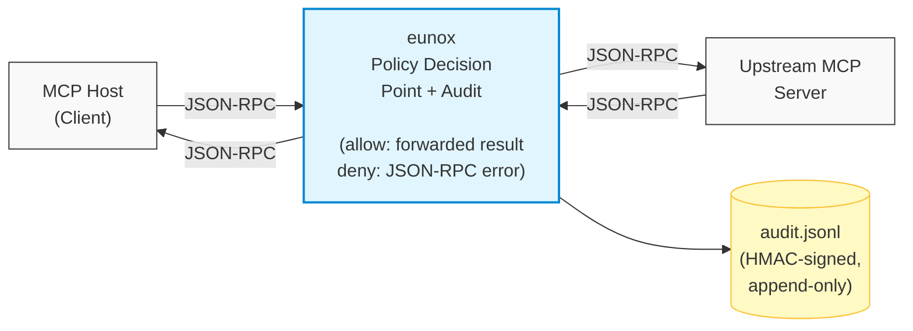

# eunox architecture

This document describes how `eunox` is structured and why: the layering,
the request path, the major components, and the extension points. For how to
*use* the proxy see the [README](../README.md) and
[client-integration.md](./client-integration.md); for the security analysis
see [threat-model-mcp.md](./threat-model-mcp.md).

## What it is

`eunox` is a policy-enforcement proxy for the
[Model Context Protocol](https://spec.modelcontextprotocol.io/). It sits
between an MCP host (Claude Desktop, Claude Code, Cursor, ...) and one or more
upstream MCP servers. Every enforced MCP method — `tools/call`,
`resources/read`, `resources/subscribe`, `resources/unsubscribe`, `prompts/get`,
`sampling/createMessage` — is checked against a YAML capability manifest
before it is forwarded. `*/list` responses are filtered down to permitted
entries, so the host never even sees tools it cannot call. Every decision,
allow or deny, is written to an HMAC-SHA256-signed OCSF JSONL audit log.



A denied request never reaches the upstream; the host receives a structured
JSON-RPC error carrying a machine-readable denial code.

## Design principles

These are the load-bearing decisions; new code is expected to preserve them
(see [CONTRIBUTING.md](../CONTRIBUTING.md)).

- **Fail closed.** On any ambiguity — missing manifest entry, unmapped MCP
  method, malformed JWT, kill-switch backend error, unparseable response that
  needs redaction — the answer is deny, with a structured error code
  (`AUTHORIZATION_FAILED`, `CONDITION_FAILED`, `KILL_SWITCH_ERROR`, ...), and
  the decision is logged.
- **Complete mediation.** Every `PolicyDecisionPoint` implementation must
  decide every enforced method explicitly. There is no silent fall-through to
  "forward verbatim": a PDP that does not know a method denies it.
- **The manifest is an allowlist.** A tool, resource, or prompt that is
  absent from the manifest is denied by default. Constraints are scoped by
  namespace type (`tool:`, `resource:`, `prompt:`, `system:`) — a `tool:`
  entry can never satisfy a `resource:` lookup.
- **Audit records are append-only and structured.** Records are never
  rewritten; free-form text never goes into structured fields; new top-level
  fields require a threat-model update.
- **Auditing stays off the hot path.** Recording a decision is a struct
  initialization and a non-blocking channel send; serialization, signing, and
  disk I/O happen in a background goroutine.
- **One static binary, no telemetry.** eunox never phones home. There is no
  background network activity beyond what the configuration declares (the
  upstream, optional JWKS endpoint, optional Redis) — no analytics, usage
  reporting, or update checks. New runtime dependencies need strong
  justification.
- **Pre-1.0, no compatibility shims.** Manifest grammar, audit shape, and
  config keys change cleanly, with the migration documented.

## Layering

Three layers, one module:

| Layer | Role |
| ----- | ---- |
| `cmd/eunox/` | The binary: CLI subcommands, transport wiring, and PDP wiring. |
| `internal/` | Subsystems factored out of the binary behind narrow seams, importable only within this module: `internal/audit` (the tamper-evident audit log, consumed through the exported `audit.Sink`), `internal/mcp` (the MCP protocol message types plus the JSON-RPC envelope/newline-framing/classification layer — `RPCMsg`, `MsgReader`/`MsgWriter`, `MsgKey`, the response builders — shared by the transports, PDPs, and the CLI's live-upstream probe), `internal/pdp` (the policy decision points — the `PolicyDecisionPoint` contract and its `ManifestPDP`/`JWTPDP`/`AlwaysAllowPDP` implementations), `internal/config` (the config + manifest loading layer — `GatewayConfig` parsing, `LocalManifest` load/validate/merge, schema-version negotiation), `internal/drift` (the startup manifest-drift-comparison policy — `CheckManifestDrift`/`MakeDriftCheck`/`UpstreamTool`/`Warning`/`ParseToolsListResult`, and the `CheckFunc` hook type; shared by the binary's `validate --live` and the transport runtime), `internal/registry` (the effect-contract corpus format and its loader/verifier — authoring-time input only, never consulted on the decision path), and `internal/transport` (the stdio + HTTP/gateway transport runtime — the proxies, the shared dispatch/forward/enforcement core, the remote-upstream bridge, the route wiring, and the control-token/OAuth-metadata/health endpoints; the binary constructs the proxies and calls `Start`/`Serve`). `internal/mcp` is the layering foundation for `internal/pdp` and `internal/transport`; `internal/config` and `internal/drift` are sibling lower layers (`internal/drift` builds on `internal/{config,mcp,pdp}` + `pkg/*`) that both the CLI and the transport layer import. |
| `pkg/` | Importable libraries: the enforcement engine, manifest/condition types, and the operational backends. Apache-2.0, reusable outside the proxy. |

Within `pkg/`:

| Package | Role |
| ------- | ---- |
| `pkg/capability` | Manifest, constraint, condition, and directive types; manifest validation; JWKS fetching and JWT verification. |
| `pkg/enforcement` | The decision engine: constraint matching, condition evaluation via a handler registry, argument-schema validation, Rego input construction. |
| `pkg/callcounter` | Call-count store for `maxCalls` conditions — in-memory and Redis backends behind one interface. |
| `pkg/killswitch` | Emergency kill switch — in-memory and Redis backends behind one interface. |
| `pkg/circuitbreaker` | Generic circuit breaker (`Do` around a fallible call). Currently guards JWKS endpoint fetches. |

The dependency direction is strictly inward — `cmd` → `internal/` → `pkg/` —
and never back: nothing in `internal/` or `pkg/` imports the binary. Within the
`internal/` layer, `internal/mcp` depends only on the stdlib, `internal/audit`
only on `pkg/capability`, `internal/config` only on `pkg/*` and `gopkg.in/yaml.v3`,
`internal/drift` only on `internal/{config,mcp,pdp}` + `pkg/{capability,enforcement}`
(it sits above config/mcp/pdp and below transport), and `internal/transport` only
on `internal/{audit,config,drift,mcp,pdp}` + `pkg/*`. `internal/transport` imports
`internal/drift` for the `CheckFunc` hook type, and the binary injects the
drift policy (`drift.MakeDriftCheck`) as that hook — the transport runtime calls
the opaque hook and never references the comparison itself, and `internal/drift`
never imports `internal/transport`, so there is no cycle.

## Request lifecycle

The path of a single enforced request (e.g. `tools/call`):

1. **Transport** parses the JSON-RPC message and extracts the method, target
   name, and arguments. Methods with no enforcement mapping are rejected —
   never forwarded by default.
2. **PDP decision.** The transport calls `PolicyDecisionPoint.Decide` (or
   `DecideResourceRead` / `DecideResourceCancel` / `DecidePromptGet`). For the
   manifest PDP the decision order is:
   1. *Kill switch* — a blocked session or agent is denied (`KILL_SWITCH`);
      a backend error also denies (`KILL_SWITCH_ERROR`), never fails open.
   2. *Constraint lookup* — the most specific manifest entry whose namespace
      type and glob pattern match the target. No match ⇒
      `AUTHORIZATION_FAILED`.
   3. *Action check* — the entry's `actions` list must contain the required
      action for the target type (`call`, `read`, `get`, `allow`) or `*`;
      otherwise `CAPABILITY_DENIED`.
   4. *Argument schema* — structural validation of the call arguments, so
      `INVALID_PARAMS` wins over condition failures for malformed requests.
   5. *Conditions* — evaluated by the enforcement engine
     (`Engine.EvaluateConditions`); any failure denies with
     `CONDITION_FAILED` semantics and the failing condition type.
3. **Forward or reject.** Allow: the request is forwarded to the upstream and
   the response returned to the host — after any obligations (e.g.
   `redactFields`) are applied to the result. Deny: a structured JSON-RPC
   error goes back to the host; the upstream is never called. The error names
   *what* was denied so an operator need not spelunk the audit log: `error.code`
   is the integer denial code, `error.message` is a human-readable sentence that
   begins with the symbolic code and names the target (and, for a condition
   failure, the failing condition type and the argument name it checked), and
   `error.data` carries the same facts structured as
   `{"code","type","target","argument"}` (empty fields omitted). None of these
   echo a raw caller-supplied argument *value* — the target and argument *name*
   are information the host already sent in the request.
4. **Audit.** Either way, exactly one audit record is enqueued with the
   decision, denial code, condition type, and any obligations applied
   (each `redactFields` obligation recorded as one `type:path` token per
   masked field, so the trail names which fields were redacted).

`resources/unsubscribe` stops after step 3. `DecideResourceCancel` runs the kill
switch, the constraint lookup, and the action check, then allows: cancelling a
subscription only reduces data flow, so it is authorized by *match alone* and
commits no session state. Charging it the entry's conditions would let a spent
`maxCalls` budget deny the unsubscribe that closes the stream the subscribe
opened, and would record a `sequenceBlock` antecedent and `labelOutput` taint for
a request that transfers nothing.

A constraint marked audit-only ("observe mode") computes the same verdict but
downgrades its own denial to a logged-but-forwarded allow; the record carries
`audit_only: true`. Kill-switch blocks and missing-entry denials are excluded
from the downgrade by construction — they stay hard denies.

List methods (`tools/list`, `resources/list`, `prompts/list`) take a
different path: the request is forwarded, and the *response* is filtered down
to entries the PDP would permit, so the host's catalog view matches what it
can actually invoke. The filter is fail-closed end to end — the PDP's kill
switch is consulted before the upstream is contacted, and a result that is
empty or cannot be parsed for filtering is replaced with an empty list rather
than forwarded verbatim.

`sampling/createMessage` flows in the opposite direction (upstream → host)
and is only forwarded when the manifest contains an explicit
`system:sampling/createMessage` entry with action `allow` or `*`.

### Limitation: server-initiated requests need a stdio upstream

Server-initiated requests — `sampling/createMessage`, `roots/list`,
`elicitation/create` — are only serviced when the upstream is reached over
**stdio** (a subprocess upstream). For a **remote HTTP upstream** the proxy's
bridge is strictly request/response: it does one POST per host request and reads
only that POST's own response body, with no persistent inbound stream from the
upstream. A remote HTTP upstream therefore has no channel on which to deliver a
server-initiated request, and any such request it attempts is never seen,
enforced, audited, or forwarded to the host — the upstream would block awaiting a
response it will never receive. This applies to both the stdio host's remote
bridge (`internal/transport/stdio_http_upstream.go`) and the gateway's
per-session remote path (`internal/transport/http_remote.go`).

This is a liveness/compatibility limitation, not a policy bypass: no unenforced
server-initiated action ever reaches the host. The request simply has no delivery
path and deadlocks upstream-side, and the startup rejection below keeps the
misleading `system:sampling/createMessage` opt-in from ever looking enforced.

A manifest `system:sampling/createMessage` opt-in on an HTTP upstream is rejected
at startup rather than loaded as a silently inert grant
(`internal/transport/route.go`). If you need server-initiated requests (sampling,
roots, elicitation) enforced, reach the upstream over **stdio**, where the
subprocess reader handles them fail-closed.

## Transports

The transport runtime lives in `internal/transport`; the binary constructs the
proxies and calls `Start`/`Serve`. The host-facing transport is selected by the
top-level `transport` key in the config (`internal/config/gateway_config.go`;
unknown YAML keys are rejected, JSON Schema in [`schemas/`](../schemas/)). It is
independent of each upstream's own transport — either side can be stdio or HTTP.

### stdio (`internal/transport/stdio.go` — `StdioProxy`)

The proxy speaks MCP over stdin/stdout to its host and fronts exactly one
upstream: either a subprocess (stdio upstream) or a remote Streamable HTTP
server (`internal/transport/stdio_http_upstream.go`). This is the shape MCP
clients launch directly from their server config.

### HTTP (`internal/transport/http.go` — `HTTPProxy`)

The proxy listens on a socket and implements MCP Streamable HTTP/SSE.
Sessions are keyed by the `Mcp-Session-Id` header; each client session gets
its own upstream connection (one subprocess per session for stdio upstreams).
A loopback-only `/control/kill` endpoint serves the kill switch
(`eunox kill`).

### Gateway mode

With `transport: http` the same `HTTPProxy` multiplexes N upstreams, each
mounted at `/mcp/<name>` with its own manifest, PDP, and policy version.
Per-route state lives in `internal/transport/route.go` (`UpstreamRoute`); a
`routeSink` wrapper stamps every audit record with the route name,
`policy_version`, and `policy_sha256`, so one audit tape covers the whole fleet
and each decision is attributable to the exact policy document in force.

`BuildRoutes` is fail-closed on construction: a route with no `policy:` is
rejected at startup unless it explicitly declares `enforcement: audit`. An
absent policy is treated as a misconfiguration, not an intent to passthrough,
so the gateway refuses to start rather than silently mounting an unenforced
route — consistent with the proxy-wide fail-closed invariant.

## Policy decision points

`internal/pdp/pdp.go` defines the one contract the transports program against:

- **`PolicyDecisionPoint`** — `Decide` / `DecideResourceRead` /
  `DecideResourceCancel` / `DecidePromptGet`, each returning a
  `capability.EnforceResponse` (the same type the enforcement engine produces),
  plus a `CheckKill` entry point the `*/list` handlers consult before contacting
  the upstream. `DecideResourceCancel` is `resources/unsubscribe`'s own entry
  point rather than a synonym for the read: a cancellation is authorized by match
  alone and commits no session state, because metering it would let a spent quota
  deny the only way to close a stream the policy allowed opening. It embeds two named
  facets — **`ListFilterer`** (`FilterToolsList` / `FilterResourcesList` /
  `FilterPromptsList`) and **`SamplingAuthorizer`** (`DecideSampling`) — folded
  into the single contract rather than detected by type assertion, so every PDP
  implements list filtering and sampling authorization and the transports call
  them directly. There is no optional-interface fallback that could silently
  leave a list unfiltered or a method un-decided — the same "decide every method
  explicitly" rule the core three methods enforce.

Implementations:

| PDP | Source | Behavior |
| --- | ------ | --------- |
| `ManifestPDP` | `internal/pdp/pdp.go` | Enforces the local YAML manifest through the `pkg/enforcement` engine. The default. |
| `JWTPDP` | `internal/pdp/jwt.go` | Reads capability claims from a verified JWT (keys fetched via JWKS) and **intersects** them with the manifest — a token can only restrict what the manifest allows, never expand it. Claims (`agent_id`, `task_id`, ...) flow into condition evaluation and the kill switch's per-agent dimension. Server-initiated sampling is the one carve-out: no client token is in scope for an upstream-initiated request, so `DecideSampling` checks the kill switch and then delegates to the inner manifest's `system:` opt-in (deny when there is none) — see ADR-0001. |
| `AlwaysAllowPDP` | `internal/pdp/pdp.go` | Transparent passthrough for audit/wiretap mode (`proxy --audit`): everything is forwarded, everything is logged. Used to record real traffic before authoring a policy. |
| `DenyAllPDP` | `internal/pdp/pdp.go` | Fail-closed safety net: denies every enforced method with `AUTHORIZATION_FAILED` and filters every `*/list` down to an empty list. The transport constructors substitute it when a caller wires no PDP, so the exported library seam denies by default instead of forwarding verbatim. The shipped binary always wires a concrete PDP, so this is a defense-in-depth backstop, never a runtime enforcement path. |

## The enforcement engine and the manifest model

`pkg/capability` defines the vocabulary; `pkg/enforcement` executes it.

A manifest is a list of **constraints**. Each constraint names a target
pattern (`tool:search_*`, `resource:file:///data/*`, `prompt:*`,
`system:sampling/createMessage`), an `actions` list, and optional
**conditions** and **directives**.

Conditions are string-discriminated types (authoritative list in
`pkg/capability/condition.go`): `allowedValues`, `maxCalls`, `timeWindow`,
`ipRange`, `allowedOperations`, `allowedExtensions`, `allowedTables`,
`recipientDomain`, `sequenceBlock`, `policy`, `custom`.
Conditions match a specific argument name and never silently match
alternatives; an unset argument fails the condition (fail closed).

Five further discriminators — `flowLabel` and the `labelOutput` and
`declassify` directives (information flow), `effectClass` and `blastRadius`
(effect) — plus a constraint's `effect` contract, the top-level `effectCeiling`,
and the claim-populated `${task.*}` variables landed as one batched bump and are
published in `schemaVersion: "0.2"`. They are not part of `"0.1"`: a `0.1`
manifest that uses one is refused at load, fail closed. See
[effect-contracts.md](./effect-contracts.md) for the effect layer and the
manifest guide for the grammar.

The `Engine` evaluates conditions through a `ConditionHandler` registry —
built-ins are registered at construction, and embedders can register their
own. Three seams are pluggable via functional options:

- `WithClock` — time source for `timeWindow` (tests inject a fake clock).
- `WithCallCounter` — backing store for `maxCalls` (`pkg/callcounter`).
- `WithPolicyEvaluator` — delegates `policy` conditions to an external PDP
  (e.g. OPA/Rego or Cedar). `BuildRegoInput` exposes the request — including
  `input.target.*` and JWT claims as `input.claims.*` — as evaluator input.
- `WithTaskAnchoredState` — keys accumulated state (flow taint, `sequenceBlock`
  antecedents, `maxCalls` and cumulative `blastRadius` budgets, spent single-use
  declassify grants) on the caller's validated `mcp.task_id` claim instead of on
  its session, so it survives a hop to a second enforcement point. Opt-in, and it
  falls back to session keying for a request carrying **no token** — so it can
  never make two unauthenticated callers share state — while an authenticated
  request whose token carries no task id is denied rather than accounted against a
  second bucket. `anchor.go` owns the choice, and every key builder routes through it.

One narrowing surface rides an already-verified token rather than the manifest,
because it is a property of the CALLER rather than of the policy: the
`mcp.declassify` approvals, which alone let a `declassify` directive clear a
label, single-use when marked `once`. The decision
path additionally applies every hop, so the assertion and the enforcement are
independent. Neither surface needs an experimental gate: both can only subtract.

Directives attached to an allow decision come back as **obligations** the
proxy must discharge before returning the result. `redactFields` masks
dot-path fields in tool-call result JSON post-allow — replacing each value with
the sentinel `"[redacted]"` while keeping the key; if the response cannot
be parsed for redaction the result is withheld rather than forwarded
unredacted.

## Audit pipeline

`audit.go` implements the sink. Records are OCSF-inspired (API Activity,
class 6003) JSONL, one object per line:

```json
{"class_uid":6003, "category_uid":6, "activity_id":2,
 "time":"...", "seq":42, "request_id":"...", "session_id":"...",
 "agent_id":"agent-xyz", "task_id":"task-abc", "user_id":"user-7",
 "upstream":"github", "policy_version":"0.1.0", "policy_sha256":"...",
 "target_type":"tool", "target":"delete_repo", "method":"tools/call",
 "decision":"deny", "denial_code":"AUTHORIZATION_FAILED",
 "key_id":"3a7b9c1d2e0f4a5b",
 "prev_hmac":"sha256:...", "_hmac":"sha256:..."}
```

`agent_id` / `task_id` / `user_id` (the JWT `sub` subject) are stamped from a validated JWT when one is present.

Mechanics:

- `Record(...)` is non-blocking: struct init plus a channel send. A single
  background drainer goroutine owns serialization, HMAC-SHA256 signing, and
  file I/O — the policy hot path never waits on disk.
- The queue is bounded (4096 records). When it is full, records are dropped
  and counted (`DroppedRecords`), surfacing sustained disk pressure as a
  metric rather than back-pressuring enforcement.
- Audit availability is gated by `--require-audit`, which **defaults to
  `strict`**: a log that cannot be opened is fatal at startup, and once a record
  is dropped or a write fails at runtime, every subsequent enforced call and
  `*/list` enumeration is denied with `AUDIT_UNAVAILABLE` and the upstream is not
  contacted, trading data-plane availability for audit completeness. Relax the
  default explicitly: `--require-audit=on` is startup-fatal only (no runtime
  gate), and `--require-audit=off` warns and runs unaudited. See the
  [conformance guide](./conformance.md#audit-log-and-compliance) and threat
  model §5.4.1.
- Each line is signed with a per-installation key (default
  `~/.eunox/audit.key`, overridable via `--audit-key-path` /
  `EUNOX_AUDIT_KEY_PATH` for containerized or multi-instance deployments).
  `eunox audit-verify` re-computes the HMACs to detect tampering. An
  externally-supplied key must be a full 256-bit CSPRNG value (`openssl rand
  -hex 32`); the proxy fails closed on a key that is not exactly 32 bytes or
  that is all-zero (a no-entropy placeholder that would make signatures
  forgeable). Auto-generated keys use `crypto/rand` and are unaffected.
- The key file supports rotation: one 64-hex key per line, the first active and
  the rest retired-but-retained. Every record carries a `key_id` digest of its
  signing key, so `audit-verify` selects the right key per record and a tape that
  straddles a rotation verifies end to end (threat model §3.4).
- Records form a tamper-evident hash chain: each carries a monotonic `seq`
  and a `prev_hmac` (the preceding record's `_hmac`, or a `sha256:genesis`
  sentinel for the first record of a fresh log — and for the first record of a
  chain restarted because the previous tail could not be verified; an empty
  `prev_hmac` is never emitted, so `audit-verify` treats one as a break),
  both covered by the signature and resumed across restarts and rotation. So
  `audit-verify` checks chain linkage as well as per-record HMACs — deletion,
  reordering, and insertion are detectable, not just field edits — and it
  verifies the whole rotated set (every sidecar plus the current base log) as
  one chain, so deletion of an entire interior rotated file is caught too. Full
  treatment in the threat model (§3.4 Audit Log Tampering).
- Size-based rotation is built in. When the active log would exceed
  `--audit-rotate-size`, it is renamed to a sidecar suffixed with a
  nanosecond-resolution UTC timestamp (`audit.jsonl.20060102T150405.000000000Z`)
  and a fresh active log is opened. The high-resolution suffix, plus a
  uniqueness check on the target, keeps two rotations in the same second from
  colliding — `os.Rename` would otherwise atomically replace and destroy the
  earlier rotated file.
- In gateway mode, `routeSink` stamps `upstream`, `policy_version`, and
  `policy_sha256` onto every record.
- Each record carries a structured `target_type`/`target`/`method` taken from the
  MCP method, so consumers classify a decision exactly — even an opaque resource
  URI or an oddly-named tool — rather than guessing from a single overloaded
  identifier.

The audit log is also an input: `eunox suggest` drafts a manifest from
observed traffic — classifying each decision by its recorded `target_type` so an
opaque resource URI or an oddly-named tool maps to the right namespace — and
`eunox stats` summarizes denials from it.

## Operational controls

- **Kill switch** (`pkg/killswitch`) — immediately blocks a session, an
  agent (by JWT `agent_id`), or everything. Checked first on every decision;
  a backend error denies. Activated via `eunox kill` against the HTTP
  proxy's loopback control endpoint, or directly through Redis. The Redis
  transport also carries the undo (`eunox kill --revive`) and the session-
  tombstone lifetime the proxy publishes at startup so the CLI stamps the
  same expiry the proxy would; the loopback endpoint is kill-only.
- **Call counter** (`pkg/callcounter`) — backs `maxCalls` rate conditions
  (`AdmitAll`) and `sequenceBlock` session-history
  lookups (`Peek`).
- Both ship an in-memory backend (single instance) and a Redis backend
  (`redis.go`), so multiple proxy instances can share kill-switch state and
  call budgets. Tests use miniredis.
- **Circuit breaker** (`pkg/circuitbreaker`) — guards JWKS fetches so a
  flapping IdP endpoint does not hammer the network; JWT verification fails
  closed while the breaker is open and cached keys are unavailable. The
  gateway's IdP-JWT validator (`internal/pdp`'s JWT PDP) consumes
  `pkg/capability.JWKSCache` (fetch + singleflight + breaker + TTL +
  force-refresh) directly. The shipped proxy installs a breaker by default, so
  it is always protected. Singleflight collapses only *concurrent* refreshes;
  the breaker adds the cooldown across *sequential* failures. A kid not found
  in the cached set forces a TTL-bypassing refresh so a freshly-rotated
  signing key is picked up immediately rather than after the TTL.

## CLI surface

Subcommand dispatch lives in `main.go`. The subcommands map onto a policy
lifecycle:

| Stage | Command | What it does |
| ----- | ------- | ------------ |
| Observe | `proxy --audit` | Wiretap mode: `AlwaysAllowPDP`, everything forwarded and logged. |
| Author | `init` | Deny-all starter manifest (and optionally a runnable config) generated from a live upstream's tool list. |
| Author | `suggest` | Draft manifest grounded in the audit log — entries and `allowedValues` conditions reflect what the agent actually did. |
| Validate | `validate` | Static manifest validation; with `--live`, diffs the manifest against a running upstream and reports contract drift (`internal/drift`, `validate_live.go`). |
| Enforce | `proxy --config` | The proxy itself, in stdio, HTTP, or gateway shape. |
| Operate | `kill`, `stats`, `audit-verify`, `doctor` | Emergency stop; denial histogram; log integrity check; redacted, user-initiated support bundle (nothing is uploaded). |

## Extension points

| Seam | How |
| ---- | --- |
| New condition type | Add the type to `pkg/capability/condition.go`, register a handler on the engine, table-driven tests under `pkg/capability/` (allow, deny, malformed input). |
| External policy engine | Implement `enforcement.PolicyEvaluator`; wire with `WithPolicyEvaluator`. |
| Alternative PDP | Implement the full `PolicyDecisionPoint` contract — including the embedded `ListFilterer` and `SamplingAuthorizer` facets. Every method must be decided explicitly; there is no optional list-filtering interface to skip. |
| Distributed state | Implement the `callcounter` / `killswitch` store interfaces (Redis backends are the reference). For `callcounter`, implement the single mandatory `capability.CallCounter` contract — `Peek` backs `sequenceBlock`, `AdmitAll` backs every quota bound (`maxCalls` and the cumulative `blastRadius`, over entry-counting and weight-summing buckets respectively) — and pin conformance with one `var _ capability.CallCounter = (*MyStore)(nil)` assertion so an omitted method is a build error rather than an opaque runtime deny. |
| New MCP method coverage | Transport handler + PDP decision path + a test in `internal/transport/enforcement_gaps_test.go`. |

## Related documents

- [adr/](./adr/) — Architecture Decision Records: why specific load-bearing decisions were made.
- [capability-manifest-guide.md](./capability-manifest-guide.md) — manifest authoring.
- [Capability Manifest Specification](https://github.com/eunolabs/agent-capability-manifest) — the normative grammar.
- [threat-model-mcp.md](./threat-model-mcp.md) — what the proxy defends against, and what it cannot.
- [benchmarks.md](./benchmarks.md) — enforcement overhead numbers.
- [repo-guide.md](./repo-guide.md) — building, testing, repository layout.
